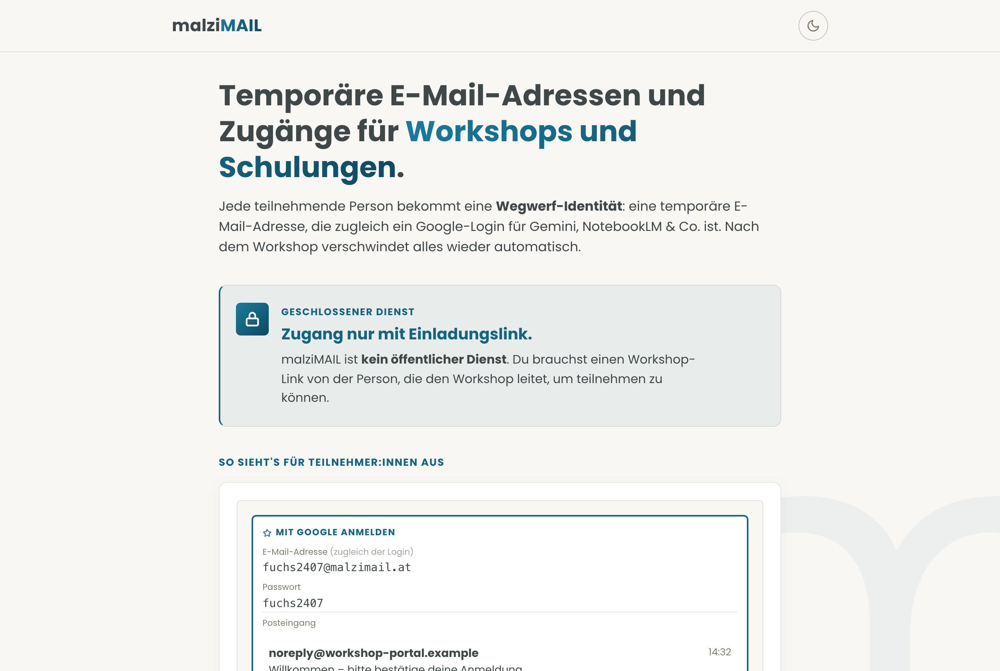

# malziMAIL

[](https://github.com/malziland/malzimail/actions/workflows/ci.yml)
[](docs/oss-projekt-charta.md)
[](LICENSE)

**Privater Wegwerf-Mail-Dienst für Workshops** — jede temporäre Adresse ist zugleich ein Wegwerf-Google-Login für Gemini & NotebookLM. Läuft komplett auf Cloudflare (Workers + D1 + Email Routing); laufende Kosten: nur die eigene Domain.



## Was es macht

- Teilnehmer:innen eines Workshops öffnen einen Link und erhalten eine **temporäre Mail-Adresse** (läuft automatisch wieder ab). Bestätigungs-Mails erscheinen direkt auf der Seite — ohne eigenes Mail-Konto, ohne Preisgabe der echten Adresse.
- Dieselbe Adresse ist zugleich ein **Wegwerf-Google-Login** (Cloud Identity, gratis bis 50 Konten) für Gemini, NotebookLM oder „Mit Google anmelden" — die Identität wird automatisch angelegt und bei Ablauf bzw. Workshop-Stopp automatisch wieder gelöscht.
- Privat by design: Zugang nur über geheimen Workshop-Link, `noindex`, keine öffentliche Registrierung.

## Selbst hosten

Siehe [docs/installation-voraussetzungen.md](docs/installation-voraussetzungen.md) (was du brauchst) und [docs/installation-anleitung.md](docs/installation-anleitung.md) (Schritt für Schritt). Kurzfassung: eigene Domain + Cloudflare-Account (gratis) + 1–2 Stunden.

**Kein Technik-Profi?** Ein KI-Assistent (z. B. Claude Code oder ChatGPT/Codex) kann dich durch die ganze Installation führen — siehe [docs/installation-mit-ki.md](docs/installation-mit-ki.md).

## Entwicklung

```bash
npm install        # Abhängigkeiten
npm test           # Tests (Vitest, läuft im Workers-Laufzeit-Pool)
npm run lint       # Linting
npm run dev        # lokale Entwicklung
npm run deploy:dev # Deploy auf die Test-Instanz
```

Architektur: [docs/architektur.md](docs/architektur.md) · Ziel-Struktur: [docs/projektstruktur.md](docs/projektstruktur.md) · Qualitätsregeln: [docs/oss-projekt-charta.md](docs/oss-projekt-charta.md) · Funktionstest (Mail + Google): [docs/funktionstest.md](docs/funktionstest.md)

## Mitmachen / Sicherheit

- Beiträge: [CONTRIBUTING.md](CONTRIBUTING.md)
- Sicherheitslücken melden: [SECURITY.md](SECURITY.md)
- Änderungen: [CHANGELOG.md](CHANGELOG.md)

## Lizenz

**Code: MIT** — siehe [LICENSE](LICENSE). © 2026 Christoph Krieger (malziland - learning | training | consulting e.U.).

**Ausgenommen: Marke.** Die Namen, Logos und Markendateien von malziland/malziMAIL (m-Monogramm, Favicons, Dateien unter [`public/img/brand/`](public/img/brand/)) sind **nicht** MIT-lizenziert — Details in [TRADEMARKS.md](TRADEMARKS.md).

**Schriften:** Poppins wird selbst gehostet und steht unter der SIL Open Font License — Lizenztext in [`public/fonts/poppins/OFL.txt`](public/fonts/poppins/OFL.txt).

## Haftungsausschluss

Diese Software wird **„wie besehen" (as is)** bereitgestellt, ohne jegliche Gewährleistung (siehe MIT-Lizenz). Wer eine eigene Instanz betreibt, ist **selbst verantwortlich** für deren rechtskonformen Betrieb — insbesondere für Impressum, Datenschutzerklärung, die DSGVO-konforme Verarbeitung der Teilnehmer-Daten und die Einhaltung der Nutzungsbedingungen der eingebundenen Dienste (z. B. Google/Cloud Identity). Der Dienst ist für kurzzeitige Bildungs-Workshops gedacht und **kein zuverlässiges Mail-Postfach**; es besteht kein Anspruch auf Verfügbarkeit oder Zustellung. Die Rechtstexte-Vorlagen im Code ersetzen **keine** anwaltliche Beratung.
